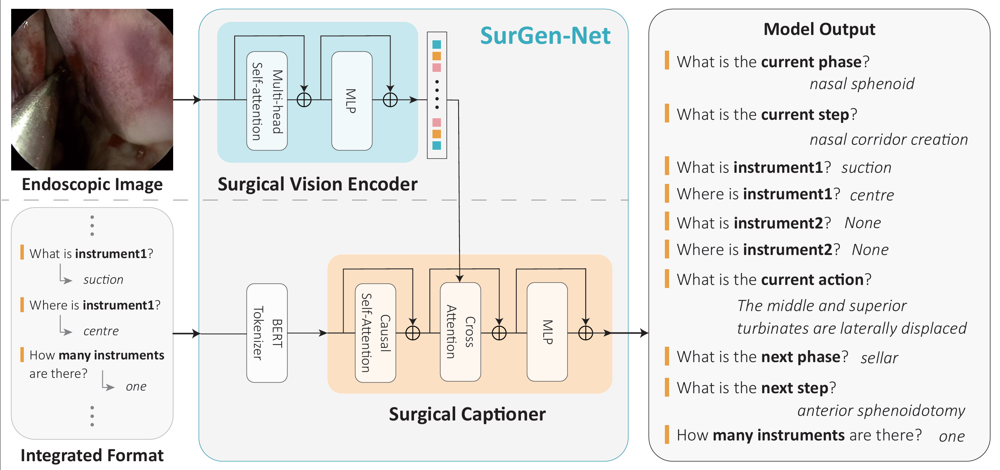

# SurGen-Net: A Generative Approach for Surgical VQA with Structured Text Generation


## Overview

Existing discriminative approaches in surgical Visual Question Answering (VQA) exhibit key limitations, including susceptibility to data distribution bias, overfitting, ineffective utilization of raw text supervision, and a lack of deep cross-modal understanding. Additionally, their reliance on fixed answer sets makes them impractical for real-world clinical applications. To address these challenges, we propose \textbf{SurGen-Net}, a generative model designed to enhance multimodal learning and contextual reasoning in surgical VQA. Unlike conventional models that treat question-answer pairs independently, our model is trained to generate a structured format, allowing it to integrate all question-answer interactions and develop a more comprehensive understanding of surgical scenes.
SurGen-Net comprises a Surgical Vision Encoder and a Surgical Captioner, utilizing raw text supervision and an advanced multimodal fusion mechanism to construct rich textual representations of surgical environments. Evaluation on the PitVQA dataset demonstrates consistent performance gains over existing models, particularly in Instruments and Position categories, highlighting its ability to enhance surgical tool recognition and spatial reasoning.

## Training

Run the following command to train the model:

```bash
python train_caption_pitvqa.py --gpu 0 \
                               --config "./configs/caption_vqa_format.yaml" \
                               --experiment_name "" \
                               --format_style "" \
                               --max_length 132 \
                               --max_epoch 10  
```

## Generation

To generate Question and Answers using the model, use the following command:

```bash
python generate.py --config "./configs/caption_vqa_format.yaml" \
                   --experiment_name "" \
                   --device "cuda:0" \
                   --start_epoch 0 \
                   --end_epoch 1 \
                   --max_length 132 \
                   --format_style ''
```

## Evaluation

To evaluate the model, use the following command: 

```bash
python evaluate.py --dir "" \
                   --epoch 5 \
                   --gt_csv ""
```

## Citation

If you use SurGen-Net in your research, please cite our work:

```
@article{your_paper,
  author    = {Your Name and Co-Authors},
  title     = {SurGen-Net: A Generative Approach for Surgical VQA with Structured Text Generation},
  journal   = {Your Journal},
  year      = {2025}
}
```
## Acknowledgments

This work builds upon the [BLIP (Bootstrapped Language-Image Pretraining)](https://github.com/salesforce/BLIP) framework. We sincerely thank the authors of BLIP for making their implementation publicly available, which served as the foundation for our Surgical Captioner module.

## Contact

For any questions or issues, please contact yjjj98\@gmail.com.

